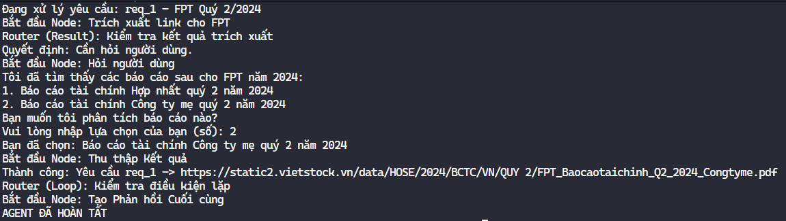
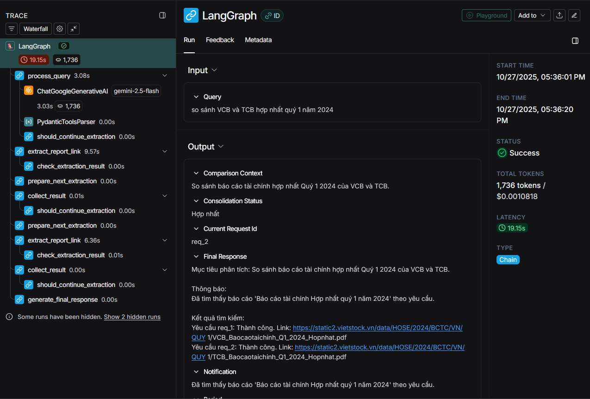
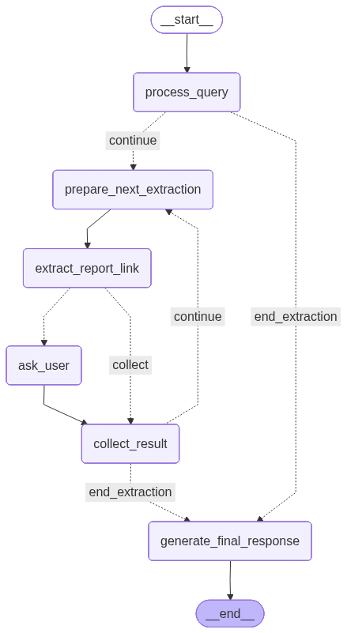

# Stock Report Agent

## Key Nodes

### process_query_node (NEW)
- Sử dụng API Gemini-2.5-flash, sử dụng được tools để biết ngày hiện tại
- Áp dụng kỹ thuật Few-shot examples để tăng độ chính xác
- Tự động bỏ qua các báo cáo chưa tồn tại giữa vào thời gian hiện tại

### ask_user_for_clarification_node (NEW)
- Cho người dùng lựa chọn giữa những báo cáo mà giống với yêu cầu người dùng (Ví dụ: Công ty mẹ/Hợp nhất)

### extract_report_link_node (UPDATED)
- Scrape Vietstock để lấy link pdf báo cáo tài chính
- Loại bỏ LLM trong việc tìm báo cáo chính xác (tăng tốc độ, tăng độ chính xác, giảm độ phức tạp, giảm chi phí)

    Tính năng:

- Tìm theo mới nhất hoặc lọc theo năm
- Lọc theo hợp nhất/công ty mẹ nếu có yêu cầu
- Lọc theo các loại quý/6 tháng/năm
- Tự fallback sang các báo cáo giống khác nếu báo cáo yêu cầu không tồn tại
## User Clarification

## LangSmith Monitoring

## Agent Graph
