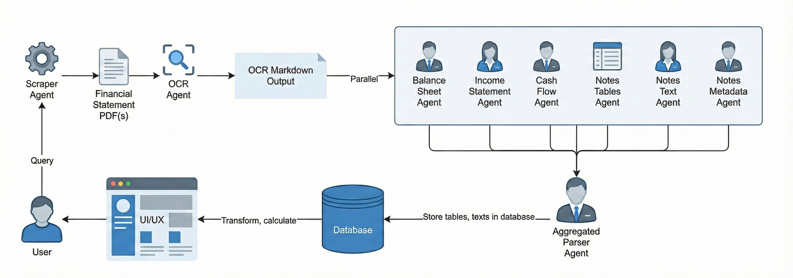

# Stock Report Agent

Hệ thống AI Agent tự động trích xuất và hỗ trợ phân tích báo cáo tài chính doanh nghiệp Việt Nam, tối ưu cho luồng xử lý end-to-end.

## Tổng quan

Agent tự động:
1. **Hiểu yêu cầu** người dùng bằng tiếng Việt tự nhiên
2. **Tìm và tải** báo cáo tài chính PDF từ Vietstock
3. **Trích xuất nội dung** bằng OCR
4. **Trích xuất cấu trúc** (Extract) - Tách 3 báo cáo chính từ OCR markdown
5. **Parse dữ liệu** - Chuẩn hóa, chuyển đổi sang format JSON cấu trúc.
6. **Tra cứu TM (Thuyết minh)** - Trích xuất TM dạng bảng theo `notes_ref` phát hiện trong 3 báo cáo
7. **Đánh giá chất lượng pipeline** với benchmark tự động
8. **UI Stock Report Agent**
## Kiến trúc

Hệ thống đã được thiết kế lại với kiến trúc pipeline 2 bước:

### 1. **Extraction Phase** (Parallel Extractors)
Các extractors chạy song song để tách riêng từng báo cáo từ OCR Markdown:
- **BalanceSheetExtractor** - Trích xuất Bảng cân đối kế toán
- **IncomeStatementExtractor** - Trích xuất Báo cáo kết quả kinh doanh  
- **CashFlowExtractor** - Trích xuất Báo cáo lưu chuyển tiền tệ
- **MetadataExtractor** - Thông tin metadata về công ty, báo cáo.

**Đặc điểm:**
- Mỗi extractor sử dụng LLM riêng với prompts chuyên biệt
- Extractor chạy song song
- Output: Raw markdown tables

**TM (Thuyết minh):**
- Không "index" toàn bộ thuyết minh.
- TM được trích xuất **sau khi parse** và chỉ theo các `notes_ref` thực sự được tham chiếu trong BS/PL/CF.
- Output TM là **tables-only** để tránh phình context và giảm rủi ro bị cắt/truncate.

### 2. **Parsing Phase** (Aggregated Parser)
Parser thống nhất nhận output từ các extractors (BS/PL/CF + metadata):
- **AggregatedParser** - Parse sang JSON chuẩn vnstock
- Sử dụng Pydantic Structured Output
- Giữ tên chỉ tiêu trung thực theo báo cáo
- Chuyển đổi đơn vị về VND (triệu VND × 1,000,000, tỷ VND × 1,000,000,000)
- Xử lý số âm, định dạng tiếng Việt (1.234.567,89)


## Kiến trúc Agent

### Stock Report Agent Architecture



### LangGraph


### Các Node chính

#### 1. **process_query_node**
Xử lý câu hỏi bằng tiếng Việt và chuyển thành yêu cầu cấu trúc.

**Tính năng:**
- Sử dụng LLM với **Few-shot learning** để hiểu ngữ cảnh
- Tích hợp tool `get_current_time` để xử lý thời gian động
- Parse thành `AnalysisIntent` với danh sách `ReportRequest`
- Tự động lọc báo cáo chưa tồn tại (ví dụ: Q4 2024 khi đang là tháng 10)
- Do giới hạn UI: danh sách `requests` chỉ có tối đa 1 yêu cầu; nếu người dùng yêu cầu nhiều báo cáo, hệ thống chọn yêu cầu đầu tiên và hiển thị cảnh báo.

**Ví dụ input:**
- "Phân tích BCTC FPT quý 3 năm 2024"
- "So sánh VCB và TCB trong quý 1 2024"
- "Xem HPG Q1, Q2, Q3 năm 2025 tăng trưởng thế nào"

#### 2. **prepare_next_extraction_node**
Lấy yêu cầu tiếp theo từ hàng đợi và cập nhật state để xử lý.

#### 3. **extract_report_link_node**
Scrape Vietstock để tìm link PDF báo cáo chính xác.

**Tính năng:**
- **Không dùng LLM** (tăng tốc độ và độ chính xác, giảm chi phí)
- Dùng requests + endpoint `/data/getdocument` để lấy danh sách tài liệu
- Tìm theo năm hoặc mới nhất
- Lọc theo loại: Hợp nhất / Công ty mẹ
- Lọc theo kỳ: Quý / 6 tháng / Cả năm
- **Auto-fallback**: Tự động chọn báo cáo thay thế nếu không tìm thấy đúng loại

Lưu ý: Streamlit UI không hỗ trợ block để hỏi qua stdin. Khi có nhiều lựa chọn, hệ thống sẽ **tự chọn mặc định hợp lý** và hiển thị thông báo để người dùng có thể yêu cầu lại rõ hơn.

#### 4. **ocr_report_node**
Trích xuất nội dung PDF thành Markdown.

**Hỗ trợ nhiều OCR providers:**
- **Hybrid (Docling + Surya)** - Docling PDF pipeline + Tesseract (vie) + Surya reroute/update cho các cell (đặc biệt số) có confidence thấp
- **Docling** - Docling PDF pipeline + Tesseract (vie)
- **Marker** - `marker-pdf` OCR

#### 5. **parse_report_node**
Parse Markdown thành dữ liệu cấu trúc JSON.

**Kiến trúc 2-phase pipeline:**

**Phase 1: Extraction**
- Chạy song song các extractors chính (BS, PL, CF, Metadata)
- Mỗi extractor tìm và trích xuất 1 loại báo cáo cụ thể

**Phase 2: Parsing** 
- AggregatedParser nhận output từ các extractors
- Sử dụng Pydantic Structured Output với schema `ParsedReport`
- Giữ tên chỉ tiêu trung thực theo báo cáo (không ép map theo danh mục cố định)
- Chuyển đổi đơn vị về VND:
  - triệu VND → × 1,000,000
  - tỷ VND → × 1,000,000,000
  - nghìn VND → × 1,000
- Xử lý định dạng số Việt Nam: `1.234.567,89` → `1234567.89`
- Xử lý số âm: `(100)` → `-100`

**TM (Thuyết minh):**
- Sau khi parse, hệ thống có thể trích xuất TM dạng bảng theo `notes_ref` (tables-only).

**Tính năng:**
- Xác định tự động:
  - **Đơn vị tiền tệ** (VND, triệu VND, tỷ VND, nghìn VND)
  - **Loại kỳ** (Quý riêng lẻ / Lũy kế từ đầu năm)
  - **Metadata** (công ty, năm, quý)

#### 6. **collect_result_node**
Thu thập kết quả đã xử lý vào state.

#### 7. **generate_final_response_node**
Tạo phản hồi cuối cùng với tóm tắt các báo cáo đã xử lý.

## Cấu hình

### Environment Variables

```bash
# API Keys
OPENROUTER_API_KEY=your_key_here
```

## Cài đặt

```bash
# Clone repository
git clone https://github.com/buinguyenkhai/stock-report-agent-20251.git
cd stock-report-agent-20251

# Tạo virtual environment
python -m venv .venv
.venv\Scripts\activate  # Windows
# source .venv/bin/activate  # Linux/Mac

# Cài đặt dependencies
pip install -r requirements.txt

# Chỉnh sửa .env với API keys của bạn

# Chạy Streamlit UI
streamlit run app.py

# (Tuỳ chọn) Chạy agent CLI demo
python agent.py
```

## Sử dụng (Đang cập nhật)

## OCR Benchmark

Hệ thống benchmark OCR dựa trên dataset **VnPDF Financial Reports** từ HuggingFace.

### Dataset

- **Source**: [kiethuynhanh/vnpdf-financial-reports-dataset](https://huggingface.co/datasets/kiethuynhanh/vnpdf-financial-reports-dataset)
- **Content**: Vietnamese financial reports with page-level ground truth
- **Companies**: AAA, ACB, FPT, MBB, MWG, SHB, TCB, VIB, VPB

### Metrics (Primary Reporting)

| Metric | Description | Why It Matters |
|--------|-------------|----------------|
| **Format-Agnostic CER** | Character error rate after stripping formatting (pipes, dashes, markdown) | Fair comparison across OCR engines with different table formats |
| **Content Word Recall** | Fraction of ground truth words found in OCR output | Measures content completeness |
| **Number F1** | Precision/Recall/F1 for locale-robust numeric tokens (supports thousand/decimal separators, negatives, %) | Critical for financial reports - are numbers extracted correctly? |

### Running Benchmark

```bash
# Quick validation (1 page per company)
python -m evaluation.ocr_benchmark.page_level_benchmark --engine docling_pdf --max-pages 1

# Docling PDF baseline benchmark
python -m evaluation.ocr_benchmark.page_level_benchmark --engine docling_pdf --output results/docling_pdf_full.json

# Hybrid Docling benchmark (Tesseract + Surya reroute)
python -m evaluation.ocr_benchmark.page_level_benchmark --engine hybrid_docling --output results/hybrid_docling_full.json

# Hybrid knobs
python -m evaluation.ocr_benchmark.page_level_benchmark --engine hybrid_docling --hybrid-threshold 0.7 --hybrid-number-threshold 0.85

# Compact JSON
python -m evaluation.ocr_benchmark.page_level_benchmark --engine hybrid_docling --minimal-json --output results/hybrid_docling_minimal.json

# Full Marker benchmark
python -m evaluation.ocr_benchmark.page_level_benchmark --engine marker --output results/marker_full.json

# Marker with LLM post-processing (requires OPENROUTER_API_KEY)
python -m evaluation.ocr_benchmark.page_level_benchmark --engine marker --marker-llm --output results/marker_llm_full.json

# Only benchmark table pages
python -m evaluation.ocr_benchmark.page_level_benchmark --engine docling_pdf --table-only

# Specific companies
python -m evaluation.ocr_benchmark.page_level_benchmark --companies AAA FPT VPB --max-pages 5 --engine docling_pdf
```

### Analyze Multiple Runs (Compare Engines)

```bash
python -m evaluation.ocr_benchmark.analyze_results \
  --docling results/docling_pdf_full.json \
  --hybrid results/hybrid_docling_full.json \
  --marker results/marker_full.json

# Optional: hybrid diff reason breakdown (requires running hybrid with --export-hybrid-diffs)
python -m evaluation.ocr_benchmark.analyze_results \
  --docling results/docling_pdf_full.json \
  --hybrid results/hybrid_docling_full.json \
  --diffs-root results/hybrid_diffs
```

### Error Analysis

```bash
python -m evaluation.ocr_benchmark.error_analyzer --input results/docling_pdf_full.json --output results/error_analysis.json
```

## License

MIT License
