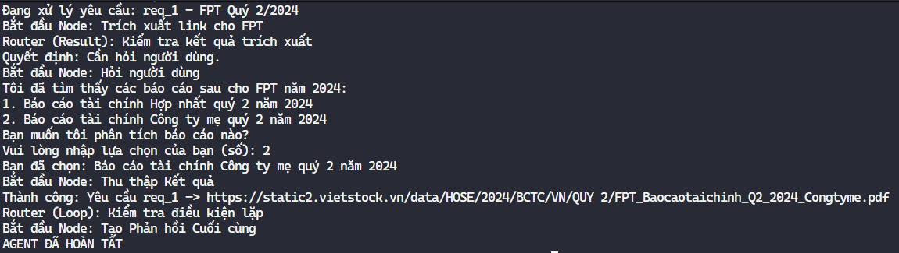
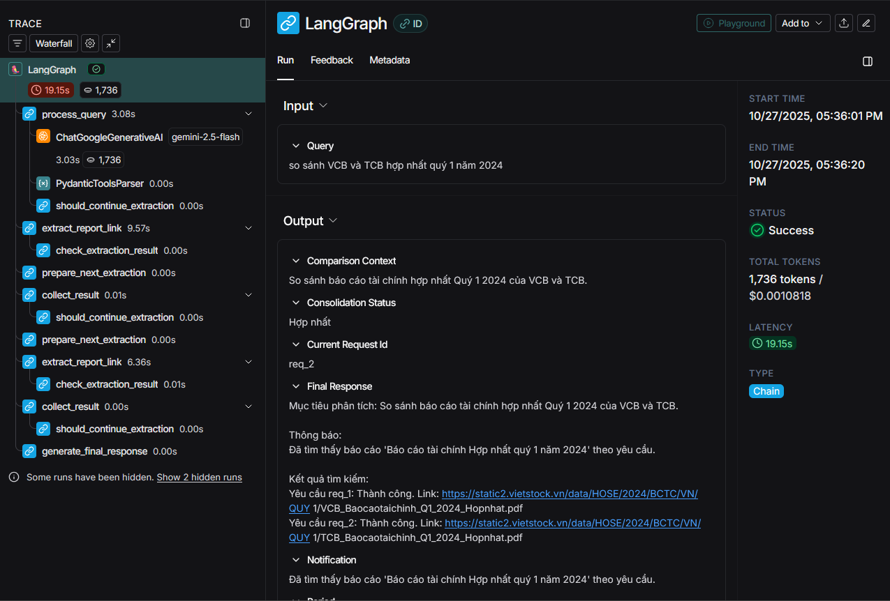

# Stock Report Agent

Hệ thống AI Agent tự động trích xuất và hỗ trợ phân tích báo cáo tài chính doanh nghiệp Việt Nam bằng LangGraph, với khả năng xử lý đa báo cáo và tự động hóa từ đầu đến cuối.

## Tổng quan

Agent tự động:
1. **Hiểu yêu cầu** người dùng bằng tiếng Việt tự nhiên
2. **Tìm và tải** báo cáo tài chính PDF từ Vietstock
3. **Trích xuất nội dung** bằng OCR
4. **Parse dữ liệu** thành cấu trúc JSON chuẩn
5. **Kiểm tra tính hợp lệ** dữ liệu theo các phương trình kế toán
6. **Đang cập nhật**

## Kiến trúc Agent

### Workflow Graph (LangGraph)


### Các Node chính

#### 1. **process_query_node**
Xử lý câu hỏi bằng tiếng Việt và chuyển thành yêu cầu cấu trúc.

**Tính năng:**
- Sử dụng LLM với **Few-shot learning** để hiểu ngữ cảnh
- Tích hợp tool `get_current_time` để xử lý thời gian động
- Parse thành `AnalysisIntent` với danh sách `ReportRequest`
- Tự động lọc báo cáo chưa tồn tại (ví dụ: Q4 2024 khi đang là tháng 10)
- Hỗ trợ đa yêu cầu (so sánh nhiều công ty, nhiều quý)

**Ví dụ input:**
- "Phân tích BCTC FPT quý 3 năm 2024"
- "So sánh VCB và TCB trong quý 1 2024"
- "Xem HPG Q1, Q2, Q3 năm 2025 tăng trưởng thế nào"

#### 2. **prepare_next_extraction_node**
Lấy yêu cầu tiếp theo từ hàng đợi và cập nhật state để xử lý.

#### 3. **extract_report_link_node**
Scrape Vietstock để tìm link PDF báo cáo chính xác.

**Tính năng:**
- **Không dùng LLM** (tăng tốc độ và độ chính xác, giảm chi phí)
- Tìm theo năm hoặc mới nhất
- Lọc theo loại: Hợp nhất / Công ty mẹ
- Lọc theo kỳ: Quý / 6 tháng / Cả năm
- **Auto-fallback**: Tự động chọn báo cáo thay thế nếu không tìm thấy đúng loại

#### 4. **ask_user_for_clarification_node**
Hỏi người dùng khi có nhiều lựa chọn (ví dụ: Hợp nhất vs Công ty mẹ).

#### 5. **ocr_report_node**
Trích xuất nội dung PDF thành Markdown.

**Hỗ trợ nhiều OCR providers:**
- **Marker** (mặc định) - API cloud
- **Docling** - IBM open-source
- **VIntern** - Vietnamese-optimized
- **PaddleOCR** - Lightweight local

#### 6. **parse_report_node**
Parse Markdown thành dữ liệu cấu trúc JSON.

**Tính năng:**
- Trích xuất 3 bảng chính: Balance Sheet (BS), Income Statement (PL), Cash Flow (CF)
- Xác định tự động:
  - **Đơn vị tiền tệ** (VND, triệu VND, tỷ VND, nghìn VND)
  - **Phạm vi báo cáo** (Hợp nhất / Công ty mẹ)
  - **Loại kỳ** (Quý riêng lẻ / Lũy kế từ đầu năm)
- **Smart column selection**: Tự động chọn cột số liệu đúng (kỳ hiện tại, bỏ qua kỳ trước/lũy kế)
- Xử lý số âm trong ngoặc đơn: `(100)` → `-100`

**Sử dụng:**
- LLM chính: `mistralai/devstral-2512:free` (cấu hình cho parsing task)
- Output schema: `FinancialReportData` (Pydantic)

#### 7. **collect_result_node**
Thu thập kết quả đã xử lý vào state.

#### 8. **generate_final_response_node**
Tạo phản hồi cuối cùng với tóm tắt các báo cáo đã xử lý.

## Cấu trúc dữ liệu

### Input Models

```python
class ReportRequest(BaseModel):
    """Yêu cầu tìm một báo cáo cụ thể."""
    stock_code: str  # "FPT", "VCB"
    year: int
    period: Literal["Quý", "6 tháng", "Cả năm", "Mới nhất"]
    quarter: Optional[int]  # Chỉ với period="Quý"
    consolidation_status: Optional[Literal["Hợp nhất", "Công ty mẹ"]]

class AnalysisIntent(BaseModel):
    """Ý định phân tích tổng thể."""
    requests: List[ReportRequest]
    comparison_context: str  # "So sánh kết quả kinh doanh"
```

### Output Models

```python
class FinancialItem(BaseModel):
    """Một dòng trong báo cáo."""
    item_code: Optional[str]  # "110", "01"
    item_name: str  # "Tiền và các khoản tương đương tiền"
    value: Optional[float]
    notes_ref: Optional[str]

class FinancialReportData(BaseModel):
    """Dữ liệu báo cáo hoàn chỉnh."""
    unit: Literal["VND", "triệu VND", "tỷ VND", "nghìn VND"]
    report_scope: Literal["consolidated", "parent"]
    period_type: Literal["quarterly", "cumulative"]
    balance_sheet: List[FinancialItem]
    income_statement: List[FinancialItem]
    cash_flow: List[FinancialItem]
    notes: List[FinancialNote]
```

## Services

### LLM Factory
Quản lý tạo LLM instances với cấu hình tối ưu theo task.

**Task-specific configs:**
- `item_matching`: temp=0, max_tokens=150, frequency_penalty=0.1
- `unit_detection`: temp=0, max_tokens=100
- `parsing`: temp=0, max_tokens=8000, timeout=180s
- `query_processing`: temp=0, max_tokens=500

**Default model:** `mistralai/devstral-2512:free` (qua OpenRouter)

### Parser Service
Parse Markdown → JSON với validation.

**Features:**
- Retry logic với exponential backoff
- Structured output với Pydantic schema

### Validator Service
Kiểm tra tính nhất quán của dữ liệu tài chính.

**Validation rules:**
- **Balance Sheet**: Tổng tài sản = Tổng nguồn vốn
- **Income Statement**: Lợi nhuận sau thuế = Lợi nhuận trước thuế - Thuế hiện hành - Thuế hoãn lại
- **Cash Flow**: Tiền cuối kỳ = Tiền đầu kỳ + Lưu chuyển tiền ròng + Chênh lệch tỷ giá

**Tolerance:** ±1.0 (configurable)

### LLM Utils
Các utility functions cho LLM:
- **Item Matching**: Match tên chỉ tiêu với canonical names
- **Unit Detection**: Xác định đơn vị tiền tệ

## Cấu hình

### Environment Variables

```bash
# API Keys
OPENROUTER_API_KEY=your_key_here
MARKER_API_KEY=your_marker_key  # Nếu dùng Marker OCR
```

### Thay đổi LLM Model

**Cách 1: Environment variable**
```bash
LLM_MODEL="z-ai/glm-4.5-air:free"
```

**Cách 2: Trong code**
```python
from config import settings
settings.llm_model = "openai/gpt-4-turbo"
```

## Screenshots

### User Clarification


### LangSmith Monitoring


## Cài đặt

```bash
# Clone repository
git clone https://github.com/buinguyenkhai/stock-report-agent-20251.git
cd stock-report-agent-20251

# Tạo virtual environment
python -m venv .venv
.venv\Scripts\activate  # Windows
# source .venv/bin/activate  # Linux/Mac

# Cài đặt dependencies
pip install -r requirements.txt

# Chỉnh sửa .env với API keys của bạn

# Chạy agent
python agent.py
```

## Sử dụng (Đang cập nhật)

```python
from agent import agent

# Chạy agent với query
final_state = agent.invoke({
    "query": "So sánh FPT và VCB quý 3 năm 2024"
})

# Xem kết quả
print(final_state["final_response"])
```

## Testing & Evaluation

Agent có hệ thống đánh giá tự động:
- Ground truth data trong `data/ground_truth/`
- Evaluation metrics trong `evaluation/`
- Benchmark results trong `benchmark_results/`

```bash
# Chạy benchmark
python run_benchmark.py
```

## License

MIT License