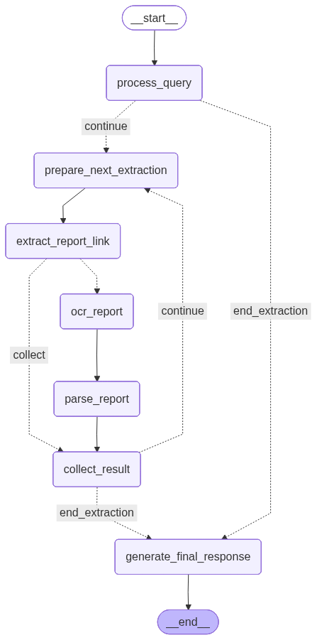

# Stock Report Agent

Hệ thống AI Agent tự động trích xuất và hỗ trợ phân tích báo cáo tài chính doanh nghiệp Việt Nam, với khả năng xử lý đa báo cáo và tự động hóa từ đầu đến cuối.

## Tổng quan

Agent tự động:
1. **Hiểu yêu cầu** người dùng bằng tiếng Việt tự nhiên
2. **Tìm và tải** báo cáo tài chính PDF từ Vietstock
3. **Trích xuất nội dung** bằng OCR
4. **Trích xuất cấu trúc** (Extract) - Tách 3 báo cáo chính, thuyết minh và các thông tin khác từ OCR markdown
5. **Parse dữ liệu** - Chuẩn hóa, chuyển đổi theo format database chuẩn.
6. **Đánh giá chất lượng pipeline** với benchmark tự động
7. **Đang cập nhật**
## Kiến trúc

Hệ thống đã được thiết kế lại với kiến trúc pipeline 2 bước:

### 1. **Extraction Phase** (Parallel Extractors)
6 extractors chuyên biệt chạy song song để tách riêng từng báo cáo từ OCR Markdown:
- **BalanceSheetExtractor** - Trích xuất Bảng cân đối kế toán
- **IncomeStatementExtractor** - Trích xuất Báo cáo kết quả kinh doanh  
- **CashFlowExtractor** - Trích xuất Báo cáo lưu chuyển tiền tệ
- **NotesTablesExtractor** - Trích xuất Bảng số liệu trong thuyết minh.
- **NotesTextExtractor** - Trích xuất Văn bản, giải trình trong thuyết minh.
- **MetadataExtractor** - Thông tin metadata về công ty, báo cáo.

**Đặc điểm:**
- Mỗi extractor sử dụng LLM riêng với prompts chuyên biệt
- Extractor chạy song song
- Output: Raw markdown tables

### 2. **Parsing Phase** (Aggregated Parser)
Parser thống nhất nhận output từ cả 6 extractors:
- **AggregatedParser** - Parse sang JSON chuẩn vnstock
- Sử dụng Pydantic Structured Output
- Chuẩn hóa tên chỉ tiêu theo vnstock vocabulary
- Chuyển đổi đơn vị về VND (triệu VND × 1,000,000, tỷ VND × 1,000,000,000)
- Xử lý số âm, định dạng tiếng Việt (1.234.567,89)


## Kiến trúc Agent

### Stock Report Agent Architecture


### LangGraph



### Các Node chính

#### 1. **process_query_node**
Xử lý câu hỏi bằng tiếng Việt và chuyển thành yêu cầu cấu trúc.

**Tính năng:**
- Sử dụng LLM với **Few-shot learning** để hiểu ngữ cảnh
- Tích hợp tool `get_current_time` để xử lý thời gian động
- Parse thành `AnalysisIntent` với danh sách `ReportRequest`
- Tự động lọc báo cáo chưa tồn tại (ví dụ: Q4 2024 khi đang là tháng 10)
- Hỗ trợ đa yêu cầu (so sánh nhiều công ty, nhiều quý)

**Ví dụ input:**
- "Phân tích BCTC FPT quý 3 năm 2024"
- "So sánh VCB và TCB trong quý 1 2024"
- "Xem HPG Q1, Q2, Q3 năm 2025 tăng trưởng thế nào"

#### 2. **prepare_next_extraction_node**
Lấy yêu cầu tiếp theo từ hàng đợi và cập nhật state để xử lý.

#### 3. **extract_report_link_node**
Scrape Vietstock để tìm link PDF báo cáo chính xác.

**Tính năng:**
- **Không dùng LLM** (tăng tốc độ và độ chính xác, giảm chi phí)
- Tìm theo năm hoặc mới nhất
- Lọc theo loại: Hợp nhất / Công ty mẹ
- Lọc theo kỳ: Quý / 6 tháng / Cả năm
- **Auto-fallback**: Tự động chọn báo cáo thay thế nếu không tìm thấy đúng loại

#### 4. **ask_user_for_clarification_node**
Hỏi người dùng khi có nhiều lựa chọn (ví dụ: Hợp nhất vs Công ty mẹ).

#### 5. **ocr_report_node**
Trích xuất nội dung PDF thành Markdown.

**Hỗ trợ nhiều OCR providers:**
- **Marker** (mặc định) - API cloud
- **Docling** - IBM open-source
- **VIntern** - Vietnamese-optimized
- **PaddleOCR** - Lightweight local

#### 6. **parse_report_node**
Parse Markdown thành dữ liệu cấu trúc JSON.

**Kiến trúc 2-phase pipeline:**

**Phase 1: Extraction**
- Chạy song song 6 extractors (BS, PL, CF, NotesTable, NotesText, Metadata)
- Mỗi extractor tìm và trích xuất 1 loại báo cáo cụ thể

**Phase 2: Parsing** 
- AggregatedParser nhận output từ cả 6 extractors
- Sử dụng Pydantic Structured Output với schema `ParsedReport`
- Chuẩn hóa tên chỉ tiêu theo vnstock vocabulary
- Chuyển đổi đơn vị về VND:
  - triệu VND → × 1,000,000
  - tỷ VND → × 1,000,000,000
  - nghìn VND → × 1,000
- Xử lý định dạng số Việt Nam: `1.234.567,89` → `1234567.89`
- Xử lý số âm: `(100)` → `-100`

**Tính năng:**
- Xác định tự động:
  - **Đơn vị tiền tệ** (VND, triệu VND, tỷ VND, nghìn VND)
  - **Loại kỳ** (Quý riêng lẻ / Lũy kế từ đầu năm)
  - **Metadata** (công ty, năm, quý)

#### 7. **collect_result_node**
Thu thập kết quả đã xử lý vào state.

#### 8. **generate_final_response_node**
Tạo phản hồi cuối cùng với tóm tắt các báo cáo đã xử lý.

## Cấu hình

### Environment Variables

```bash
# API Keys
OPENROUTER_API_KEY=your_key_here
MARKER_API_KEY=your_marker_key  # Nếu dùng Marker OCR
```

## Cài đặt

```bash
# Clone repository
git clone https://github.com/buinguyenkhai/stock-report-agent-20251.git
cd stock-report-agent-20251

# Tạo virtual environment
python -m venv .venv
.venv\Scripts\activate  # Windows
# source .venv/bin/activate  # Linux/Mac

# Cài đặt dependencies
pip install -r requirements.txt

# Chỉnh sửa .env với API keys của bạn

# Chạy agent
python agent.py
```

## Sử dụng (Đang cập nhật)

## OCR Benchmark

Hệ thống benchmark OCR dựa trên dataset **VnPDF Financial Reports** từ HuggingFace.

### Dataset

- **Source**: [kiethuynhanh/vnpdf-financial-reports-dataset](https://huggingface.co/datasets/kiethuynhanh/vnpdf-financial-reports-dataset)
- **Content**: Vietnamese financial reports with page-level ground truth
- **Companies**: AAA, ACB, FPT, MBB, MWG, SHB, TCB, VIB, VPB

### Metrics (Primary Reporting)

| Metric | Description | Why It Matters |
|--------|-------------|----------------|
| **Format-Agnostic CER** | Character error rate after stripping formatting (pipes, dashes, markdown) | Fair comparison across OCR engines with different table formats |
| **Content Word Recall** | Fraction of ground truth words found in OCR output | Measures content completeness |
| **Number F1** | Precision/Recall/F1 for digit sequences | Critical for financial reports - are numbers extracted correctly? |

### Running Benchmark

```bash
# Quick validation (1 page per company)
python -m evaluation.ocr_benchmark.page_level_benchmark --engine docling --max-pages 1

# Full Docling benchmark
python -m evaluation.ocr_benchmark.page_level_benchmark --engine docling --output results/docling_full.json

# Full Marker benchmark
python -m evaluation.ocr_benchmark.page_level_benchmark --engine marker --output results/marker_full.json

# Marker with LLM post-processing (requires OPENROUTER_API_KEY)
python -m evaluation.ocr_benchmark.page_level_benchmark --engine marker --marker-llm --output results/marker_llm_full.json

# Only benchmark table pages
python -m evaluation.ocr_benchmark.page_level_benchmark --engine docling --table-only

# Specific companies
python -m evaluation.ocr_benchmark.page_level_benchmark --companies AAA FPT VPB --max-pages 5
```

### Error Analysis

```bash
python -m evaluation.ocr_benchmark.error_analyzer --input results/docling_full.json --output results/error_analysis.json
```

## Testing & Evaluation (Đang cập nhật)

Hệ thống benchmark LLM pipeline đầy đủ:

### Benchmark Architecture

**Test Data:**
- 4 báo cáo thực tế: DBC Q1/2022, FPT Q4/2024, VCB Q2/2023, VIC Q3/2024
- Ground truth từ vnstock API (CSV format)
- OCR output cached trong `evaluation_results_pipeline/`

**Benchmark Tasks:**
1. **EXTRACTION** - Đánh giá extractors:
   - Metrics: Required items found (70%+ để pass)
   - Extractors tìm đúng 35+ required items cho mỗi báo cáo

2. **PARSING** - Đánh giá parser:
   - Metrics: Match rate (tìm đúng items), Value accuracy (sai số <5%)
   - Cần extracted files từ extraction benchmark trước

3. **FULL_PIPELINE** - End-to-end test:
   - Chạy extraction + parsing liền
   - Đo latency tổng thể và accuracy cuối

### Running Benchmarks

```bash
# Chạy tất cả tasks với nhiều models
python run_benchmark.py

# Chỉ chạy extraction
python run_benchmark.py --task extraction

# Chỉ chạy parsing (cần chạy extraction trước)
python run_benchmark.py --task parsing

# Chạy với model cụ thể
python run_benchmark.py --task parsing --models "mistralai/devstral-2512:free"

# Skip OCR preparation (nếu đã có cached)
python run_benchmark.py --skip-prepare --task extraction

# Chỉ prepare OCR data
python run_benchmark.py --prepare-only
```

### Benchmark Results (testing)


## License

MIT License